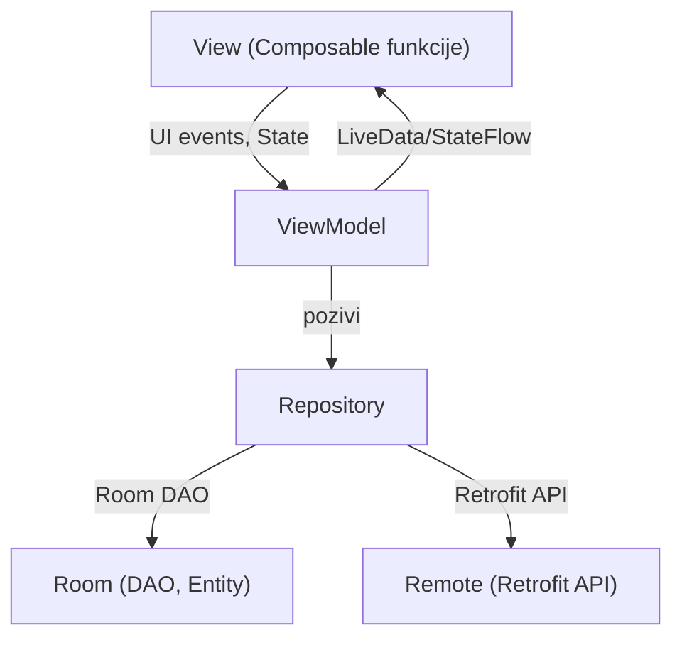

# Dokumentacija Android aplikacije

## Sadržaj

1. **Uvod**
2. **Opis rada aplikacije**  
   - Opis funkcionalnosti  
   - Screenshots (mjesto za slike)
3. **Arhitektura aplikacije (MVVM)**
   - Dijagram komponenti i interakcija
   - Objašnjenje MVVM pristupa
4. **Opis ključnih klasa**
   - ViewModel-i
   - Repository klase
   - DAO objekti
   - Ključne Composable funkcije
5. **Korištene Android i Jetpack biblioteke**
   - Room
   - ViewModel
   - Compose: životni ciklus, State, remember
   - Coroutines i Flow
   - Retrofit
   - Navigacija u Compose
   - Material 3 Theming
6. **Zaključak**

---

## 1. Uvod

Ova dokumentacija opisuje Android aplikaciju razvijenu korištenjem modernih Jetpack komponenti i MVVM arhitekture. Aplikacija omogućava pregled, pretragu i označavanje podataka o novorođenčadi i smrtnosti, dodavanje favorites stavki, dijeljenje stavki, prikaz graficki kroz grafikone uz mogućnost autentifikacije korisnika.

---

## 2. Opis rada aplikacije

Aplikacija omogućava:
- Prikaz liste novorođenčadi i smrtnosti po godinama, kantonima i institucijama
- Detaljan prikaz svakog zapisa
- Označavanje zapisa kao omiljenih (favorites)
- Prikaz omiljenih zapisa
- Registraciju i prijavu korisnika
- Prikaz korisničkog profila
- Onboarding ekran za nove korisnike

**Screenshots:**


_Onboarding ekran za nove korisnike_


_Ekran za prijavu korisnika_


_Ekran za registraciju korisnika_


_Početna stranica sa prikazom podataka_


_Detaljan prikaz pojedinačnog zapisa_


_Prikaz omiljenih zapisa_


_Profil korisnika_

---

## 3. Arhitektura aplikacije (MVVM)

Aplikacija koristi MVVM (Model-View-ViewModel) arhitekturu:



- **View**: Jetpack Compose Composable funkcije
- **ViewModel**: Upravljanje stanjem i logikom
- **Repository**: Apstrakcija izvora podataka (lokalno i udaljeno)
- **LocalData**: Room baze, DAO i Entity klase
- **RemoteData**: Retrofit API servisi

---

## 4. Opis ključnih klasa

### ViewModel-i

- `HomeViewModel`, `NewbornViewModel`, `DeathsViewModel`, `LoginViewModel`, `RegisterViewModel`, `ProfileViewModel`, `OnboardingViewModel`
- Upravljaju stanjem ekrana, koristeći `StateFlow` ili `LiveData`
- Komuniciraju s repozitorijima i izlažu podatke za UI

**Primjer potpisa:**
```kotlin
class NewbornViewModel(
    private val repository: NewbornRepository
) : ViewModel()
```

### Repository klase

- `NewbornRepository`, `DeathsRepository`, `DatasetRepository`, `FavoriteRepository`, `UserRepository`
- Apstrahiraju pristup podacima (Room + Retrofit)
- Sadrže suspend funkcije i Flow za reaktivno dohvaćanje podataka

**Primjer potpisa:**
```kotlin
class NewbornRepository(
    private val newbornDao: NewbornDao,
    private val apiService: NewbornApiService
)
```

### DAO objekti

- `NewbornDao`, `DeathsDao`, `FavoriteDao`, `DatasetDao`, `UserDao`
- Definiraju SQL upite za Room bazu
- Annotirani s `@Dao`

**Primjer potpisa:**
```kotlin
@Dao
interface NewbornDao
```

### Ključne Composable funkcije

- `HomeScreen`, `NewbornListScreen`, `DeathsListScreen`, `DetailsScreen`, `FavoritesScreen`, `ProfileScreen`, `LoginScreen`, `RegisterScreen`, `OnboardingScreen`, `SplashScreen`
- Svaka funkcija prikazuje određeni ekran i koristi ViewModel za podatke

**Primjer potpisa:**
```kotlin
@Composable
fun NewbornListScreen(
    viewModel: NewbornViewModel,
    onItemClick: (Int) -> Unit
)
```

---

## 5. Korištene Android i Jetpack biblioteke

### Room

- Omogućava lokalno spremanje podataka
- Entity, DAO, Database klase

### ViewModel

- Upravljanje stanjem neovisno o životnom ciklusu ekrana

### Jetpack Compose

- Deklarativni UI framework
- Upravljanje stanjem: `State`, `remember`, `mutableStateOf`
- Životni ciklus Composable funkcija

### Coroutines i Flow

- Asinhrono programiranje
- Flow za reaktivno emitiranje podataka

### Retrofit

- HTTP klijent za komunikaciju s REST API-jem

### Navigacija u Compose

- Navigacija između ekrana pomoću NavHost i NavController

### Material 3 Theming

- Moderni dizajn i theming aplikacije

---

## 6. Zaključak

Aplikacija je modularna, skalabilna i koristi najbolje prakse modernog Android razvoja. MVVM arhitektura, Jetpack Compose i ostale Jetpack biblioteke omogućavaju jednostavno održavanje i proširivanje funkcionalnosti.

---

**Mjesto za slike ekrana:**  
Preporučujem da slike ekrana smjestiš u folder `docs/screenshots/` i u dokumentaciji ih referenciraš ovako:

```md

``` 