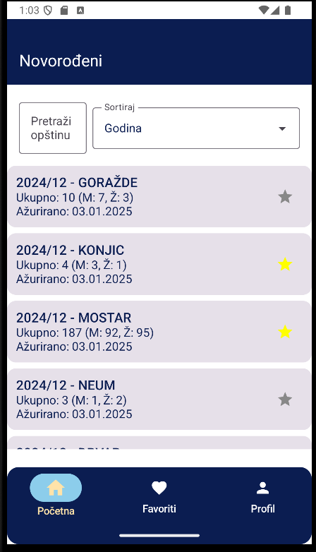

# Dokumentacija aplikacije "WebApiApplication"

---

## 1. Uvod

Aplikacija **WebApiApplication** je moderna Android aplikacija razvijena u Kotlin programskom jeziku koristeći Jetpack Compose za korisnički interfejs. Glavna svrha aplikacije je prikaz i analiza javno dostupnih podataka sa **Portala Otvorenih Podataka Bosne i Hercegovine (ODP BiH)**, s posebnim fokusom na podatke o novorođenima i umrlima. Aplikacija omogućava korisnicima da pregledaju, filtriraju, sortiraju, dijele i sačuvaju omiljene podatke, uz lokalnu autentifikaciju i keširanje podataka radi offline pristupa.

---

## 2. Funkcionalnosti aplikacije

### 2.1. Prikaz javnih datasetova
- **Novorođeni** – statistika o broju rođenih po godinama, entitetima, opštinama i drugim parametrima.
- **Umrli** – statistika o broju umrlih, sa detaljima po spolu, godini, mjesecu, entitetu, opštini i ustanovi.
- **Ostali datasetovi** – generički podaci iz ODP BiH, prikazani na početnom ekranu.

### 2.2. Filtriranje i sortiranje
- Korisnici mogu filtrirati podatke po opštini, godini, entitetu i vrsti dataset-a.
- Sortiranje je omogućeno po godini, ukupnom broju i opštini, što olakšava analizu i pronalazak relevantnih informacija.

### 2.3. Favoriti
- Svaki korisnik može označiti određene zapise kao favorite. Favoriti su dostupni na posebnom ekranu, a podaci o favoritima se čuvaju lokalno za svakog korisnika.

### 2.4. Dijeljenje podataka
- Aplikacija omogućava dijeljenje detalja o pojedinačnim zapisima (npr. umrli) putem standardnog Android dijeljenja (`Intent.ACTION_SEND`). Korisnik može lako podijeliti podatke putem emaila, poruka ili društvenih mreža.

### 2.5. Autentifikacija korisnika
- Aplikacija podržava lokalnu registraciju i prijavu korisnika. Svaki korisnik ima svoj profil, a podaci o favoritima i preferencijama su vezani za korisnički nalog.

### 2.6. Keširanje i offline pristup
- Podaci se keširaju u lokalnoj Room bazi, što omogućava pregled posljednje preuzete verzije podataka i kada korisnik nema pristup internetu.

### 2.7. Onboarding i podešavanje preferencija
- Prilikom prvog pokretanja, korisnik prolazi kroz onboarding ekran gdje bira vrstu podataka koje želi pratiti, entitet, opštinu i godinu. Ove preferencije se mogu kasnije mijenjati u profilu.

### 2.8. Grafički prikaz podataka
- U detaljima umrlih prikazan je grafikon (bar chart) koji vizualizira broj umrlih po spolu i ukupno, što korisniku daje brzi vizualni uvid u podatke.

---

## 3. Tehnička arhitektura

### 3.1. Korištene tehnologije
- **Jezik:** Kotlin
- **UI:** Jetpack Compose
- **Arhitektura:** MVVM (Model-View-ViewModel)
- **Baza:** Room (za lokalno keširanje podataka)
- **API komunikacija:** Retrofit + Moshi/Gson
- **Preference storage:** DataStore
- **Navigacija:** Navigation Compose
- **Dijeljenje:** Android Intents
- **Verzijsko upravljanje zavisnostima:** `libs.versions.toml`
- **Dependency injection:** Ručno, bez Hilt-a

### 3.2. Struktura projekta
- **data/** – Slojevi za pristup podacima (remote, local, repository)
- **domain/** – Modeli podataka
- **ui/** – Svi ekrani, navigacija, custom komponente, teme
- **utils/** – Pomoćne klase (npr. Resource, DataStoreUtils)
- **MainActivity.kt** – Glavna aktivnost
- **WebApiApplication.kt** – Klasa aplikacije

## 3a. Opis arhitekture aplikacije (MVVM) sa dijagramom komponenti

Aplikacija koristi MVVM (Model-View-ViewModel) arhitekturu, što omogućava jasnu separaciju odgovornosti, olakšava testiranje i održavanje, te omogućava reaktivno ažuriranje korisničkog interfejsa. U nastavku je prikazan poboljšani dijagram glavnih komponenti i njihovih interakcija:


*Slika: Dijagram prikazuje tok podataka i interakcije između korisnika, UI sloja (Jetpack Compose, Navigation), ViewModel-a, repozitorija, udaljenih i lokalnih izvora podataka (Retrofit, Room, DataStore), kao i specijalizovanih komponenti za favorite i sesiju.*

### Objašnjenje komponenti i interakcija

- **View (Jetpack Compose UI):** Prikazuje podatke korisniku i šalje korisničke akcije (klikovi, unos, navigacija) ka ViewModel-u. UI se automatski ažurira na osnovu promjena stanja iz ViewModel-a.
- **ViewModel:** Sadrži poslovnu logiku, upravlja stanjem ekrana (StateFlow/LiveData), komunicira sa repozitorijima i izlaže podatke UI sloju. Takođe, upravlja validacijom, filtriranjem i transformacijom podataka.
- **Repository:** Centralna tačka za pristup podacima. Kombinuje podatke iz udaljenih izvora (API) i lokalnih izvora (Room, DataStore). Implementira logiku keširanja i odlučuje kada koristiti koji izvor.
- **Remote Data Source (Retrofit API Service):** Zadužen za komunikaciju sa ODP BiH API-jem, dohvat i slanje podataka putem HTTP zahtjeva.
- **Local Data Source (Room Database, DataStore):** Omogućava lokalno čuvanje podataka (entiteti, favoriti, korisničke preferencije, sesija) radi offline pristupa i bržeg učitavanja.
- **DataStore:** Koristi se za čuvanje korisničkih preferencija i sesije (npr. odabrana godina, entitet, email, status prijave).
- **FavoriteDao:** Poseban DAO sloj za upravljanje omiljenim zapisima korisnika.
- **Navigation (AppNavGraph):** Upravljanje navigacijom između ekrana, omogućava deklarativno definisanje ruta i parametara.

Ovakva arhitektura omogućava:
- Jednostavno testiranje poslovne logike (ViewModel, Repository)
- Lako proširenje aplikacije (dodavanje novih datasetova, ekrana, izvora podataka)
- Reaktivno i efikasno ažuriranje UI-a
- Jasnu separaciju odgovornosti i bolju čitljivost koda

---

## 4. API-ji i datasetovi

### 4.1. API-ji
- **Novorođeni:** `NewbornApiService` (endpoint: `/api/NewbornByRequestDate/List`)
- **Umrli:** `DeathsApiService` (endpoint: `/api/DeathsByRequestDate/List`)
- **Dataset API:** `DatasetApi` (endpoint: `/api/3/action/datastore_search`)

Svi API-ji koriste baznu adresu `https://odp.iddeea.gov.ba/` ili port `8096` za specifične servise.

### 4.2. Datasetovi
- **Novorođeni**: Prikaz broja rođenih po mjesecu, godini, entitetu, opštini, spolu.
- **Umrli**: Prikaz broja umrlih po mjesecu, godini, entitetu, opštini, spolu, ustanovi.
- **Generički datasetovi**: Prikaz podataka iz drugih javnih izvora sa ODP BiH, npr. statistika, demografija.

---

## 5. Opis ekrana i korisničkog interfejsa (uz reference na screenshotove)

### 5.1. Splash Screen

- **Opis:** Prikazuje logo aplikacije i inicijalno učitava podatke.
- **Screenshot:**


- **Detalji:** Kratka animacija ili statički prikaz prije preusmjeravanja na login ili onboarding. Ovaj ekran daje prvi vizuelni identitet aplikacije i osigurava korisniku da je aplikacija uspješno pokrenuta.

---

### 5.2. Onboarding Screen

- **Opis:** Prvi ekran nakon instalacije ili prijave, gdje korisnik bira:
  - Kategoriju podataka (Novorođeni, Izvještaji o smrtima)
  - Entitet (FBiH, RS, Brčko)
  - Opštinu (iz padajuće liste ili unosom)
  - Godinu (ručni unos)
- **Screenshot:**


- **Detalji:** Svi izbori su sačuvani u DataStore i mogu se kasnije mijenjati. UI koristi `ExposedDropdownMenuBox` za padajuće liste. Onboarding vodi korisnika kroz osnovne postavke aplikacije, omogućavajući personalizaciju prikaza podataka od samog početka.

---

### 5.3. Login Screen

- **Opis:** Ekran za prijavu korisnika sa emailom i lozinkom.
- **Screenshot:**


- **Detalji:**
  - Korisnik unosi email i lozinku u predviđena polja.
  - Prikazuju se validacijske poruke za pogrešan unos (npr. neispravan email ili prazna polja).
  - Dugme za prijavu postaje aktivno tek kada su svi podaci validni.
  - Postoji opcija za prebacivanje na ekran za registraciju.
  - Nakon uspješne prijave, korisnik se preusmjerava na početni ekran aplikacije.
  - Ovaj proces osigurava sigurnost i personalizaciju korisničkog iskustva.

---

### 5.4. Register Screen

- **Opis:** Ekran za registraciju novog korisnika.
- **Screenshot:**


- **Detalji:**
  - Polja za ime, prezime, email, lozinku, potvrdu lozinke, telefon i adresu.
  - Validacija svih polja i prikaz grešaka (npr. neusklađene lozinke, neispravan email).
  - Nakon uspješne registracije, korisnik se automatski prijavljuje i preusmjerava na onboarding ili početni ekran.

---

### 5.5. Home Screen

- **Opis:** Glavni ekran sa listom podataka iz odabranog dataset-a.
- **Screenshot:**



- **Detalji:**
  - Prikaz podataka u listi (`LazyColumn`).
  - Svaki podatak prikazan kroz custom komponentu `DatasetCard`.
  - Top bar sa nazivom "ODP BiH - Podaci".
  - Navigacija putem donje trake (`BottomNavBar`).
  - Omogućeno brzo pretraživanje i filtriranje podataka.

---

### 5.6. Deaths List Screen

- **Opis:** Prikaz liste umrlih sa mogućnošću filtriranja i sortiranja.
- **Screenshot:**

*(Ovaj ekran može biti prikazan unutar Home Screen-a, pa nije izdvojen poseban screenshot.)*

- **Detalji:**
  - Filtriranje po opštini (pretraga), entitetu, godini.
  - Sortiranje po godini, ukupnom broju, opštini.
  - Svaki zapis ima dugme za dodavanje u favorite.
  - Swipe-to-refresh podrška.

---

### 5.7. Details Screen (DeathsDetailsScreen)

- **Opis:** Prikaz detalja za pojedinačni zapis o umrlima.
- **Screenshot:**


- **Detalji:**
  - Prikaz svih atributa (entitet, kanton, opština, ustanova, godina, mjesec, ukupno, ažurirano).
  - **Grafički prikaz:** Bar chart sa brojem umrlih po spolu i ukupno.
  - Dugme za dijeljenje podataka (share).
  - Dugme za dodavanje/uklanjanje iz favorita.
  - Ovaj ekran omogućava korisniku detaljan uvid u podatke i dodatne akcije nad zapisom.

---

### 5.8. Favorites Screen

- **Opis:** Prikaz svih omiljenih zapisa korisnika.
- **Screenshot:**


- **Detalji:**
  - Prikazani su favoriti iz oba dataset-a (novorođeni i umrli).
  - Klikom na zapis otvara se detaljan prikaz.
  - Ako nema favorita, prikazuje se poruka "Nema sačuvanih podataka".
  - Ovaj ekran omogućava brz pristup najvažnijim podacima za korisnika.

---

### 5.9. Profile Screen

- **Opis:** Prikaz korisničkog profila.
- **Screenshot:**


- **Detalji:**
  - Prikaz imena, prezimena, emaila, telefona i adrese.
  - Dugme za promjenu preferencija (vraća na onboarding).
  - Dugme za odjavu.
  - Ovaj ekran omogućava korisniku upravljanje ličnim podacima i preferencijama.

---

## 6. Tehnički detalji i implementacija

### 6.1. MVVM arhitektura
- **ViewModel-i**: Svaki ekran ima svoj ViewModel (npr. `HomeViewModel`, `DeathsViewModel`, `NewbornViewModel`, `LoginViewModel`, `RegisterViewModel`).
- **Repository pattern**: Svi podaci se dohvaćaju preko repozitorija koji kombinuju lokalne i remote izvore.
- **Room baza**: Svi podaci se keširaju lokalno, omogućavajući offline rad.

### 6.2. API komunikacija
- **Retrofit** se koristi za komunikaciju sa ODP BiH API-jem.
- **Moshi** i **Gson** za parsiranje JSON odgovora.
- **OkHttp** za HTTP klijent i dodavanje autorizacijskih headera.

### 6.3. DataStore
- **DataStore** se koristi za čuvanje korisničkih preferencija (entitet, opština, godina, tip dataset-a, email).

### 6.4. Navigacija
- **Navigation Compose** omogućava deklarativnu navigaciju između ekrana.
- **BottomNavBar** omogućava brzi pristup glavnim sekcijama: Početna, Favoriti, Profil.

### 6.5. Custom UI komponente
- **DatasetCard**: Prikazuje osnovne informacije o datasetu.
- **BarChart**: Prikazuje grafikon broja umrlih (custom Compose komponenta).
- **BottomNavBar**: Navigacija kroz aplikaciju.
- **ExposedDropdownMenuBox**: Za izbor entiteta, opštine, dataset tipa.

### 6.6. Favoriti
- **FavoriteEntity**: Veza između korisnika i zapisa (novorođeni ili umrli).
- **FavoriteRepository**: Upravljanje dodavanjem/uklanjanjem favorita.
- **Dao sloj**: Upiti za provjeru, dodavanje i uklanjanje favorita.

### 6.7. Autentifikacija
- **UserEntity**: Model korisnika.
- **UserRepository**: Upravljanje registracijom, loginom i ažuriranjem korisnika.
- **LoginViewModel/RegisterViewModel**: Logika za validaciju i upravljanje korisničkim sesijama.

### 6.8. Keširanje i offline rad
- Prilikom svakog dohvaćanja podataka, prvo se prikazuju lokalni podaci iz Room baze.
- Ako je dostupna mreža, podaci se ažuriraju i keširaju.
- U slučaju greške/mrežnog problema, korisniku se prikazuju posljednji dostupni podaci.

### 6.9. Upravljanje stanjem i performansama
Jetpack Compose koristi deklarativni pristup interfejsu, što znači da se UI automatski osvježava kada se podaci promijene. Zbog toga je važno pažljivo upravljati stanjem. Aplikacija koristi MutableStateFlow unutar ViewModel-a za interno upravljanje stanjem, a StateFlow za izlaganje UI sloju. Ova kombinacija omogućava kontrolisan i efikasan re-render komponenti.

kotlin
Copy
Edit
private val _uiState = MutableStateFlow<List<DeathsEntry>>(emptyList())
val uiState: StateFlow<List<DeathsEntry>> = _uiState
ViewModel emituje novo stanje svaki put kada se izvrši nova pretraga, filtriranje ili dohvat sa API-ja. UI (npr. DeathsListScreen) automatski prikazuje novu listu bez potrebe za ručnim pozivom notifyDataSetChanged() kao u klasičnom Android pristupu.

Uz to, koristi se remember, derivedStateOf i LaunchedEffect kako bi se izbjeglo nepotrebno ponovno učitavanje podataka. Na primjer, filtrirani podaci se ne preračunavaju ako filteri ostaju isti.

### 6.10. Error handling i prikaz grešaka
Aplikacija koristi Resource wrapper klasu za obradu stanja učitavanja (Loading), uspjeha (Success) i greške (Error). Na osnovu stanja, UI prikazuje odgovarajuće komponente:

Loading: CircularProgressIndicator

Error: Poruka o grešci + opcionalno dugme za pokušaj ponovo

Success: Prikaz podataka

Primjer korištenja:

kotlin
Copy
Edit
when (val result = viewModel.uiState.collectAsState().value) {
    is Resource.Loading -> CircularProgressIndicator()
    is Resource.Success -> ShowData(result.data)
    is Resource.Error -> Text("Greška: ${result.message}")
}

### 6.11. Testiranje aplikacije
Za potrebe testiranja, aplikacija koristi modularnu arhitekturu što omogućava:

Jedinčno testiranje ViewModel-a uz korištenje runTest i Turbine

Instrumentacijske testove Compose UI-a preko composeTestRule

Testiranje Room DAO sloja koristeći inMemoryDatabaseBuilder i runBlocking

Primjer test ViewModel-a:

kotlin
Copy
Edit
@Test
fun testFilterReturnsExpectedResults() = runTest {
    val viewModel = DeathsViewModel(repository)
    viewModel.setYear(2023)
    viewModel.setMunicipality("Sarajevo")
    val result = viewModel.uiState.first()
    assert(result.isNotEmpty())
}

### 6.12. Responsivnost i orijentacija
Aplikacija je dizajnirana tako da automatski reaguje na promjene veličine ekrana i orijentacije uređaja. Korišteni su Modifier.fillMaxSize(), Spacer, BoxWithConstraints i LazyColumn za postizanje prilagodljivosti.

Takođe, Scaffold komponenta se koristi za strukturiranje ekrana s podrškom za TopAppBar, BottomBar, FloatingActionButton, što čini interfejs čitljivim i dosljednim na različitim uređajima.

### 6.13. Dijeljenje kroz više aplikacija i formatiranje teksta
Podaci koji se dijele kroz Intent.ACTION_SEND su pažljivo formatirani. Na primjer, u slučaju umrlih, korisnik dijeli poruku u obliku:

makefile
Copy
Edit
Statistika umrlih – Sarajevo 2023:
Muškarci: 102
Žene: 94
Ukupno: 196
Podaci preuzeti sa Portala Otvorenih Podataka BiH.
To omogućava korisniku da informaciju lako proslijedi putem e-maila, društvenih mreža ili instant poruka.

### 6.14. Detalji o lokalnoj sesiji
Prilikom prijave, korisnički podaci se čuvaju lokalno putem DataStore kako bi se sačuvala sesija čak i nakon zatvaranja aplikacije. Takođe, SessionManager klasa omogućava jednostavnu provjeru da li je korisnik već prijavljen, i automatski ga vodi na početni ekran bez potrebe za ponovnim loginom.

Primjer:

kotlin
Copy
Edit
if (sessionManager.isLoggedIn()) {
    navController.navigate("home")
} else {
    navController.navigate("login")
}

### 6.15. Preporučene prakse i skalabilnost
Cijela arhitektura aplikacije je projektovana da omogući lako dodavanje novih dataset-ova. Ako se ODP BiH otvori za nove podatke (npr. migracije, obrazovanje, zaposlenost), dovoljno je:

Dodati novi ApiService i Entity

Implementirati novi Repository i ViewModel

Napraviti novi ekran za prikaz podataka

---

## 7. Verzijsko upravljanje i zavisnosti
- **libs.versions.toml** koristi se za centralizirano upravljanje verzijama svih zavisnosti.
- **build.gradle.kts** koristi alias-e iz `libs.versions.toml` za deklaraciju zavisnosti.
- Glavne biblioteke: Compose, Room, Retrofit, Moshi, Gson, DataStore, Accompanist (SwipeRefresh), Navigation Compose.

---

## 8. Sigurnost i privatnost
- Svi korisnički podaci (email, lozinka, favoriti, preferencije) čuvaju se lokalno i nisu izloženi trećim stranama.
- API tokeni se čuvaju u `BuildConfig` i nisu hardkodirani u kodu.

---

## 9. Potencijalna proširenja
- **Integracija Hilt-a** za automatski dependency injection.
- **Dodavanje naprednih chartova** (npr. MPAndroidChart) za još bogatiji vizualni prikaz.
- **Push notifikacije** za obavještenja o novim podacima.
- **Višejezičnost** (trenutno je aplikacija na bosanskom/srpskom/hrvatskom jeziku).
- **Web verzija** aplikacije.

---

## 10. Zaključak

Aplikacija **WebApiApplication** je moćan alat za pregled, analizu i dijeljenje javnih podataka iz Bosne i Hercegovine. Kroz intuitivan korisnički interfejs, napredne mogućnosti filtriranja i sortiranja, te podršku za offline rad i personalizaciju, aplikacija omogućava korisnicima da brzo dođu do relevantnih informacija. Implementacija je modularna, proširiva i koristi moderne Android tehnologije, što olakšava održavanje i budući razvoj.

---

## 11. Reference na screenshotove
- **Onboarding:** `docs/screenshots/onboarding.png`
- **Login:** `docs/screenshots/login.png`
- **Register:** `docs/screenshots/register.png`
- **Home:** `docs/screenshots/homepage.png`
- **Details:** `docs/screenshots/details.png`
- **Favorites:** `docs/screenshots/favorites.png`
- **Profile:** `docs/screenshots/profile.png`

---

## 12. Prilog: Primjeri koda

### **Primjer: Prikaz dataset-a u HomeScreen-u**
```kotlin
LazyColumn(
    contentPadding = PaddingValues(16.dp),
    verticalArrangement = Arrangement.spacedBy(12.dp)
) {
    items(data) { item ->
        DatasetCard(item)
    }
}
```

### **Primjer: Dodavanje u favorite**
```kotlin
IconButton(onClick = { viewModel.toggleFavorite(entry) }) {
    Icon(
        imageVector = if (isFav) Icons.Filled.Star else Icons.Outlined.Star,
        contentDescription = if (isFav) "Ukloni iz favorita" else "Dodaj u favorite",
        tint = if (isFav) Color.Yellow else Color.Gray
    )
}
```

### **Primjer: Dijeljenje podataka**
```kotlin
val sendIntent = Intent().apply {
    action = Intent.ACTION_SEND
    putExtra(Intent.EXTRA_TEXT, shareText)
    type = "text/plain"
}
val shareIntent = Intent.createChooser(sendIntent, null)
context.startActivity(shareIntent)
```

### **Primjer: ViewModel sa StateFlow**
```kotlin
class DeathsViewModel(private val repository: DeathsRepository) : ViewModel() {
    private val _uiState = MutableStateFlow<Resource<List<DeathsEntry>>>(Resource.Loading())
    val uiState: StateFlow<Resource<List<DeathsEntry>>> = _uiState

    fun fetchDeaths(year: Int, municipality: String) {
        viewModelScope.launch {
            _uiState.value = Resource.Loading()
            _uiState.value = repository.getDeaths(year, municipality)
        }
    }
}
```

### **Primjer: Room DAO upit**
```kotlin
@Dao
interface DeathsDao {
    @Query("SELECT * FROM deaths WHERE year = :year AND municipality = :municipality")
    suspend fun getDeathsByYearAndMunicipality(year: Int, municipality: String): List<DeathsEntity>
}
```

### **Primjer: Retrofit API servis**
```kotlin
interface DeathsApiService {
    @GET("api/DeathsByRequestDate/List")
    suspend fun getDeaths(
        @Query("year") year: Int,
        @Query("municipality") municipality: String
    ): ApiResponse<List<DeathsEntry>>
}
```

### **Primjer: DataStore upotreba**
```kotlin
object DataStoreUtils {
    suspend fun saveSelectedYear(context: Context, year: Int) {
        context.dataStore.edit { prefs ->
            prefs[PreferencesKeys.SELECTED_YEAR] = year
        }
    }
    val selectedYear: Flow<Int> = context.dataStore.data
        .map { it[PreferencesKeys.SELECTED_YEAR] ?: 2023 }
}
```

### **Primjer: Custom Compose komponenta**
```kotlin
@Composable
fun DatasetCard(item: Dataset) {
    Card(
        modifier = Modifier.fillMaxWidth(),
        elevation = CardDefaults.cardElevation(4.dp)
    ) {
        Column(modifier = Modifier.padding(16.dp)) {
            Text(text = item.title, style = MaterialTheme.typography.titleMedium)
            Spacer(modifier = Modifier.height(8.dp))
            Text(text = item.description, style = MaterialTheme.typography.bodyMedium)
        }
    }
}
```

---

## 13. Kontakt i podrška

Za sva pitanja, prijedloge ili prijavu grešaka, kontaktirajte autora aplikacije ili otvorite issue na repozitoriju.

---

**Ova dokumentacija je namijenjena i krajnjim korisnicima i developerima, te pokriva sve aspekte aplikacije, od funkcionalnosti do tehničke implementacije. Ako su potrebne dodatne sekcije ili detalji, slobodno tražite!**

---

## 14. Dodatne napomene i motivacija

Otvoreni podaci predstavljaju ključan resurs za razvoj transparentnog društva i unapređenje javnih servisa. Aplikacija "WebApiApplication" ima za cilj da približi ove podatke široj javnosti, omogući lakšu analizu i podstakne građane, istraživače i donosioce odluka na korištenje javno dostupnih informacija. 

Kroz kontinuirano održavanje i nadogradnju, aplikacija će pratiti nove trendove u razvoju Android aplikacija i otvorenih podataka. Planirano je proširenje funkcionalnosti, uključujući naprednije vizualizacije, integraciju s dodatnim izvorima podataka i podršku za višejezičnost, čime će aplikacija postati još korisnija i pristupačnija svim korisnicima.

Za sva dodatna pitanja, prijedloge ili podršku, korisnici se mogu obratiti putem kontakt forme ili direktno na e-mail autora. Vaše povratne informacije su dragocjene za dalji razvoj i unapređenje aplikacije. 